# PokerThrone

一个RPG卡牌构筑冒险游戏的开发框架

当前进度：已经完成游戏框架的整体开发，并完成一个初步的Demo

游戏介绍：

世界上出现了大量的怪物，于是你要干掉他们

# 游戏流程与介绍

## 游戏主菜单

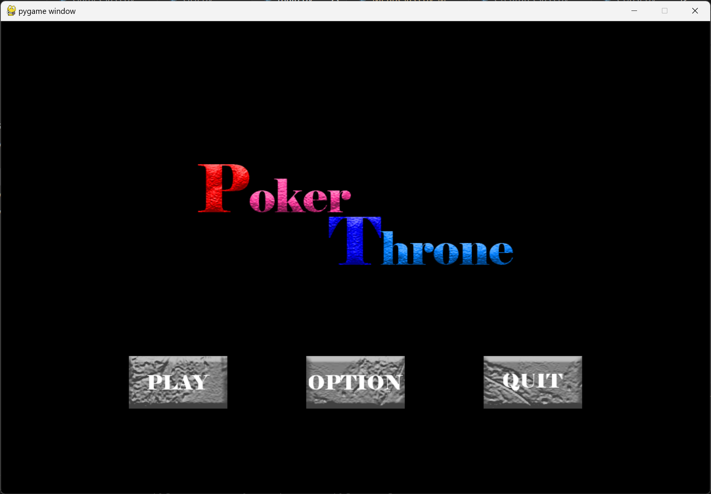

PLAY：开始游戏

OPTION：（未开发）

QUIT：退出游戏

## 为自己取一个独一无二的用户名吧！（后续排行榜开发，该功能未美化）

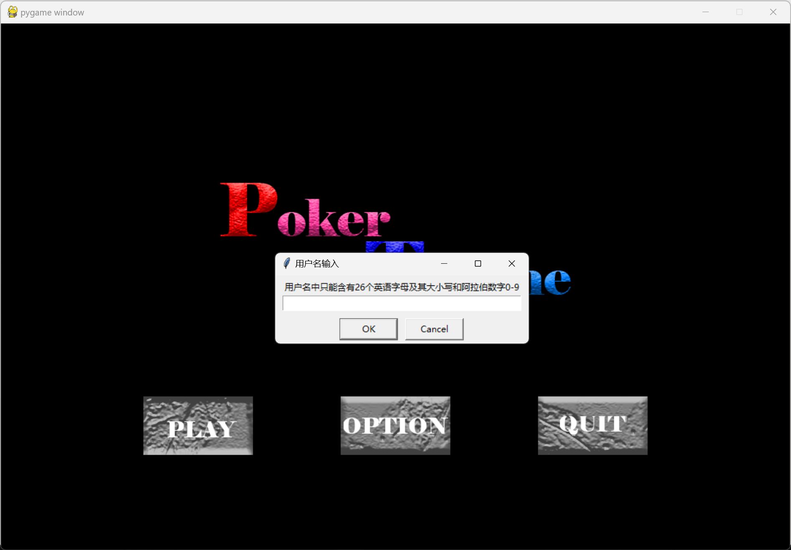

## 正式开始游戏

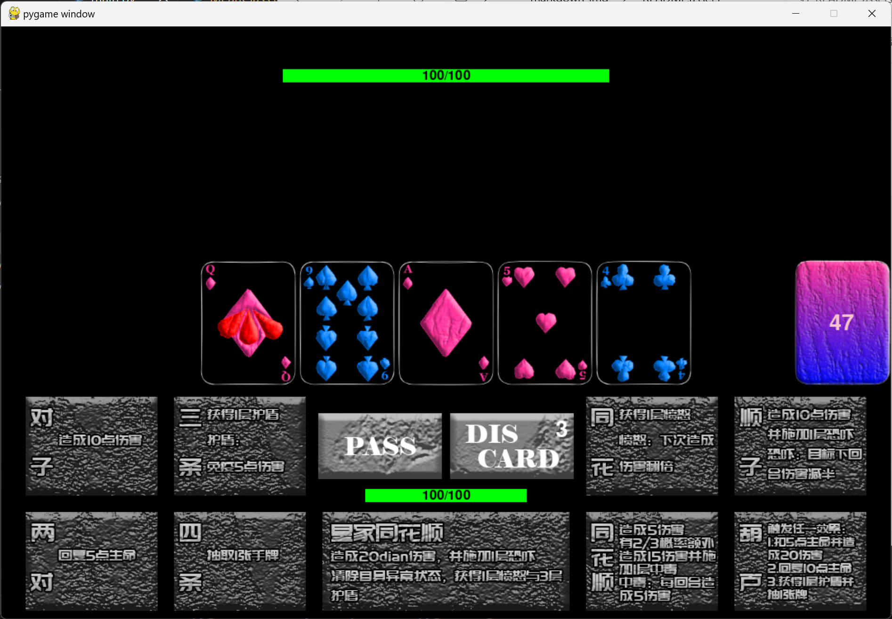

本游戏的核心玩法是配凑牌组来匹配技能，之后通过技能来攻击怪物（暂无立绘，当前只有一个血条）

当手中的五张牌满足牌型后，就释放技能

discard按钮可以重抽选中的牌：

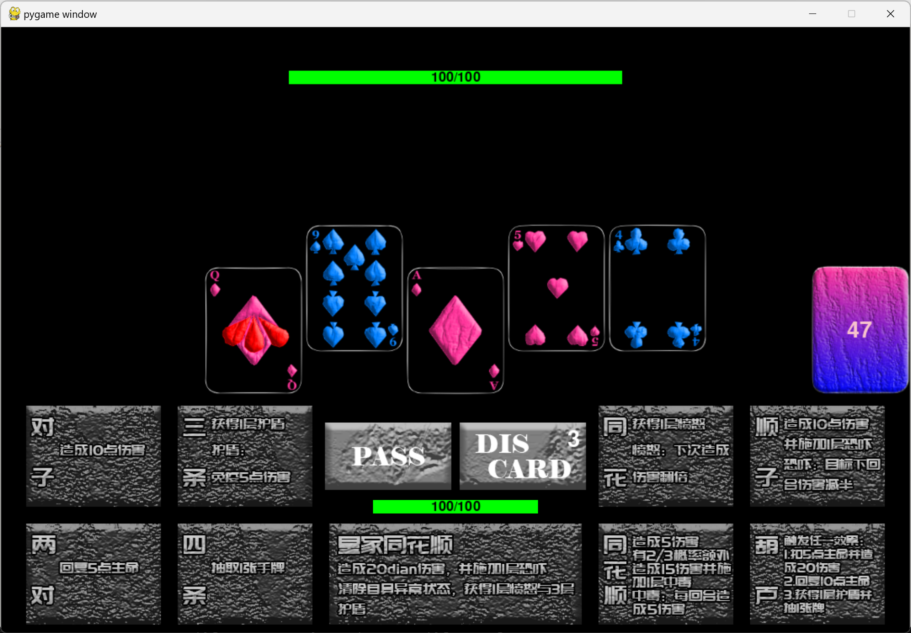

但要注意的是，discard的次数有限（在右上角显示）

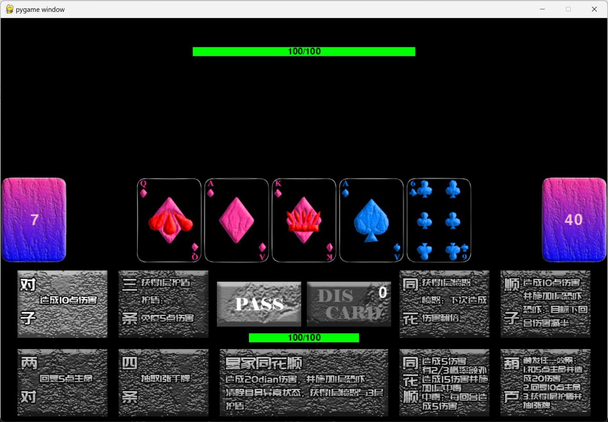

如果无法重抽，就只能选择过牌或者释放技能

左侧为弃牌堆，右侧为牌堆，（点开查看暂未开发）

# 后续开发指南

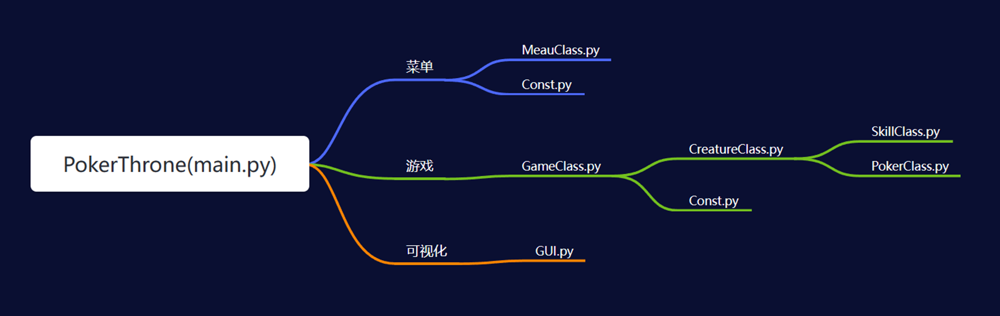

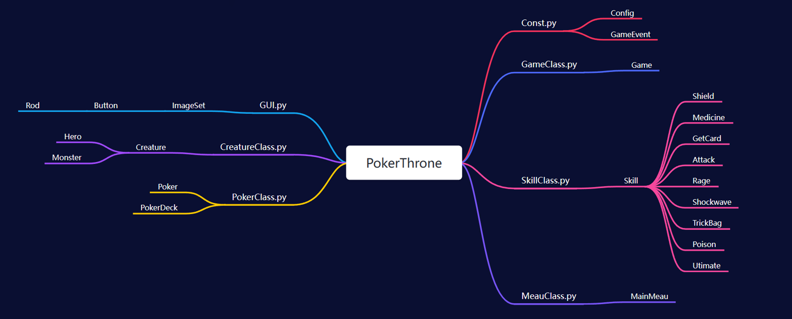

添加新的英雄，请从Hero类继承，替换hp，mp，skill_set即可

添加新的怪物，请从Monster类继承，替换hp，mp，skill_set即可

添加新的技能，请从Skill类继承，替换activate方法即可

# 作业要求响应

综合运用Python内置对象、表达式、函数、分支、循环、序列，面向对象编程、字符串、正则表达式、文件IO、异常处理，解决某个问题或实现某个功能。

Python内置对象

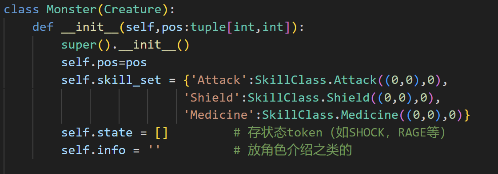

表达式

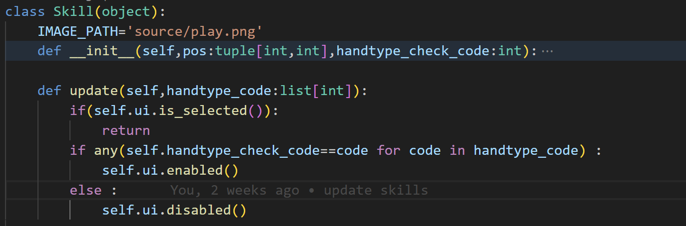

函数

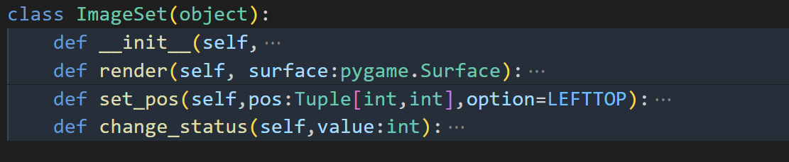

分支

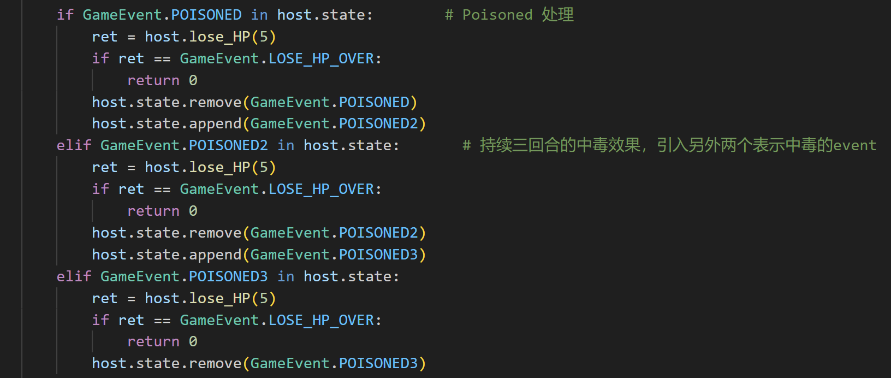

循环

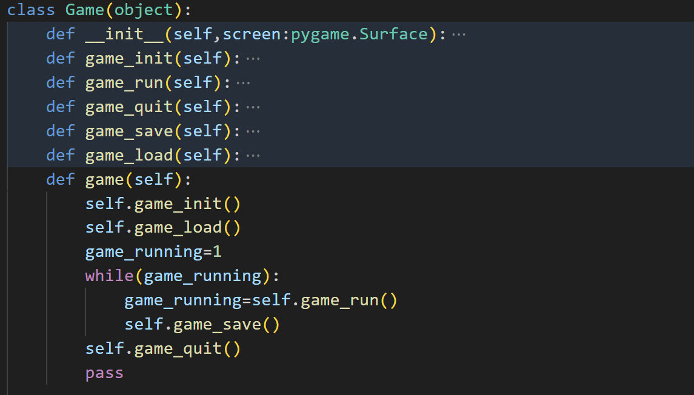

序列

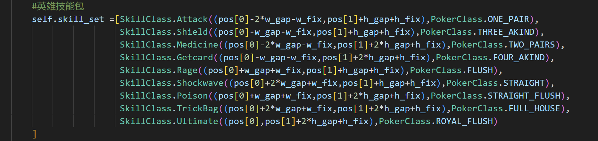

面向对象编程

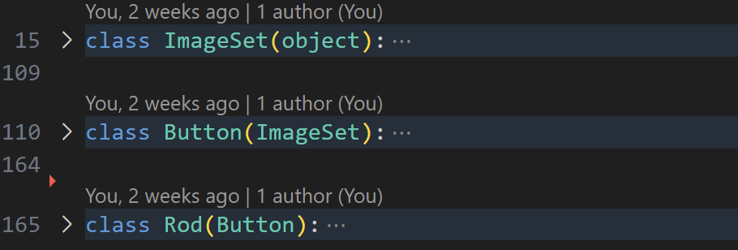

字符串，正则表达式

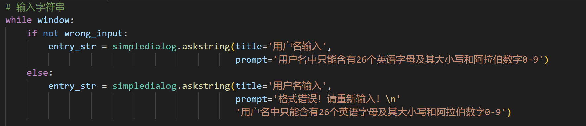

文件IO

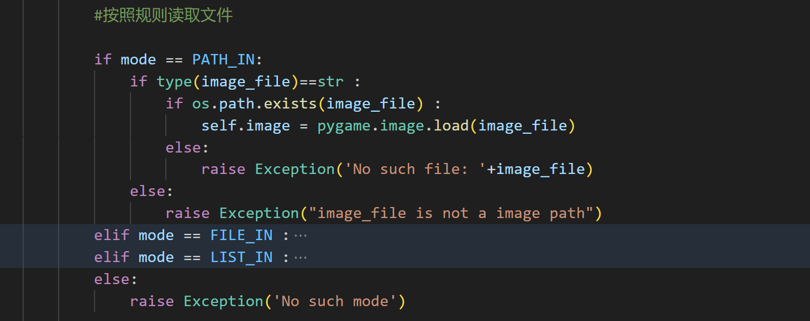

异常处理

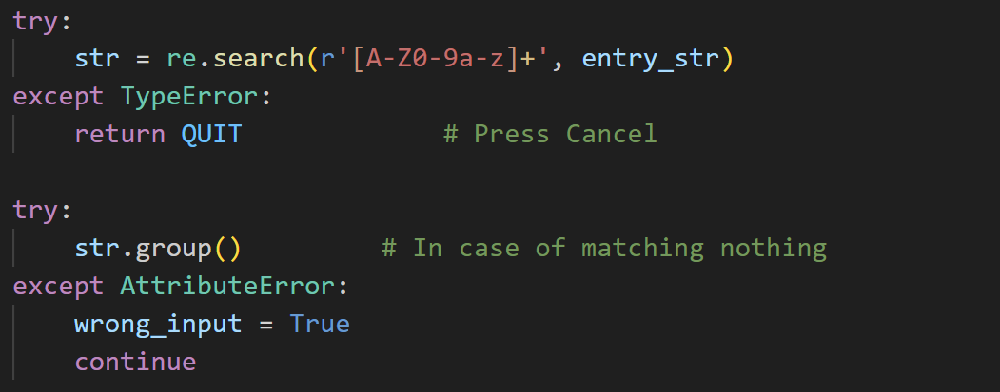

